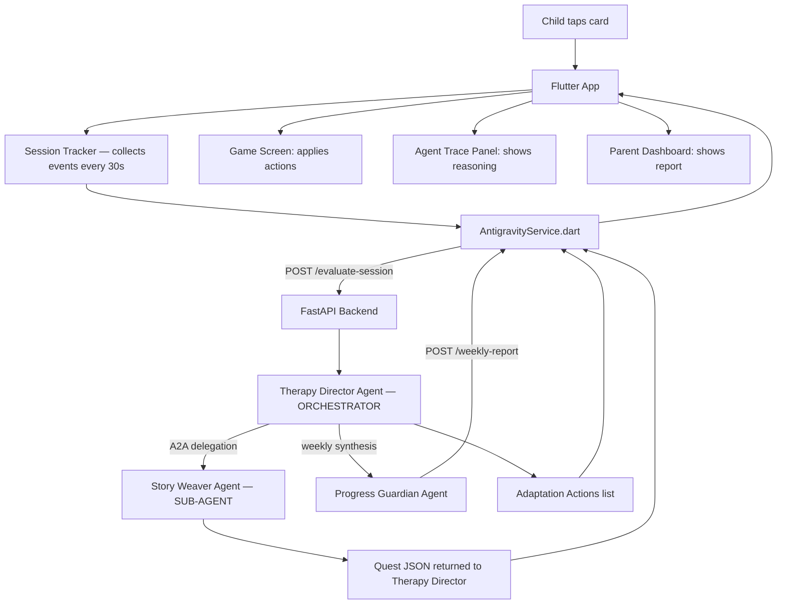

# Project Architecture Blueprint: Sitara — AI Companion Game
## Reviewed & Corrected — May 13, 2026

---

## 1. Architecture Detection and Analysis

### Technology Stack
- **Primary Technology:** Flutter (Mobile App) + Python/FastAPI (Backend) + Google ADK (Agent Orchestration)
- **AI Engine:** Gemini 2.0 Flash via Google ADK
- **Development Environment:** Google Antigravity IDE (Manager View used to build and orchestrate agents)
- **Database:** SQLite (Offline-first) + `DatabaseSessionService` for Cloud Run deployment
- **Communication:** REST API (HTTP/JSON) between Flutter and Python Backend

### Architectural Pattern
- **Pattern:** Multi-Agent Orchestration with Agent-to-Agent (A2A) delegation — Event-Driven
- **Backend Pattern:** Clean Architecture with Google ADK agent layer; Therapy Director acts as orchestrator
- **Frontend Pattern:** MVVM-inspired with Provider state management

---

## 2. Architectural Overview

Sitara follows a **Sense → Reason → Act** loop:

1. **Sense:** Flutter app captures Session Events every 30 seconds (taps, successes, failures, speed)
2. **Reason:** Therapy Director agent processes events using OBSERVE → INFER → DECIDE → ACT → LOG
3. **Delegate:** Therapy Director calls Story Weaver via A2A tool when a quest is needed
4. **Act:** Backend returns Adaptation Actions which Flutter executes immediately (switch category, trigger reward, show quest)

---

## 3. Architecture Visualization

### High-Level Flow



### Agent-to-Agent Communication (Key Differentiator)

```
Therapy Director (Orchestrator — LlmAgent with tools)
    │
    ├── [frustration detected]
    │       ├── switch_category("animals")       ← direct tool call
    │       ├── trigger_reward("star", "Shabash!") ← direct tool call
    │       └── log_insight(insight_type="struggle") ← direct tool call
    │
    ├── [engagement high → needs narrative]
    │       └── generate_quest_via_story_weaver()  ← A2A DELEGATION
    │                   │
    │                   └── Story Weaver Agent runs internally
    │                               └── returns Quest JSON to Therapy Director
    │
    └── [every session tick]
            └── get_session_state()  ← data fetch tool

Progress Guardian (Independent — called weekly from parent dashboard)
    ├── reads: log_insight() history from Firestore/SQLite
    └── returns: warm parent report (7 sections)
```

---

## 4. Core Architectural Components

### Agent 1: Therapy Director (Orchestrator)
- **Role:** Real-time game adaptation — the central brain
- **Pattern:** OBSERVE → INFER → DECIDE → ACT → LOG (visible in trace panel)
- **Frustration signals:** consecutive_failures ≥ 3, tap_speed > 3.0/sec, 30s inactivity
- **Engagement signals:** success_rate > 80%, consistent 1-2 taps/card
- **Key tool:** `generate_quest_via_story_weaver()` — A2A handoff to Story Weaver
- **Rule:** Maximum ONE adaptation per 60-second window

### Agent 2: Story Weaver (Sub-Agent)
- **Role:** Narrative generation — makes therapy feel like play
- **Trigger:** Called by Therapy Director via A2A tool (not directly by FastAPI)
- **Output:** Structured JSON quest with `quest_title`, `story_text`, `urdu_hook`, `target_category`
- **Cultural grounding:** Eid, mango, chai, billi, dadi — Pakistan-specific content

### Agent 3: Progress Guardian (Independent Synthesiser)
- **Role:** Weekly parent empowerment reports
- **Trigger:** Called directly from Flutter parent dashboard (independent of Therapy Director)
- **Tone rules:** Never clinical; always warm, specific, evidence-based
- **Data sources:** `log_insight` records from Therapy Director sessions

---

## 5. Session Persistence Strategy

| Environment | Service | Why |
|-------------|---------|-----|
| Local development | `InMemorySessionService` | Zero setup, fast testing |
| Cloud Run (demo/prod) | `DatabaseSessionService(db_url="sqlite:///./sitara_sessions.db")` | Survives instance restarts; prevents session loss on 30s heartbeat calls |

**Critical note:** Flutter calls `/evaluate-session` every 30 seconds. Cloud Run may route these to different instances. Without `DatabaseSessionService`, the Therapy Director loses session context between calls — breaking the "one adaptation per 60 seconds" rule and frustration detection continuity.

---

## 6. Architectural Layers and Dependencies

| Layer | Components | Depends On |
|-------|-----------|------------|
| **Presentation** | GameScreen, ParentScreen, AgentTraceWidget | AntigravityService, SessionTracker |
| **Service** | AntigravityService.dart | FastAPI backend (HTTP) or LocalFallback (offline) |
| **Orchestration** | agent.py — Therapy Director, Story Weaver, Progress Guardian | google-adk, Gemini 2.0 Flash |
| **Data** | LocalDbService (SQLite), symbols_data.dart | sqflite, Hive |
| **Session** | DatabaseSessionService / InMemorySessionService | google-adk sessions module |

---

## 7. Cross-Cutting Concerns

### Frustration Detection (Privacy-Safe)
No camera, no biometrics. Uses tap behaviour exclusively:
- `tap_speed` > 3.0/sec → agitation signal
- `consecutive_failures` ≥ 3 → frustration threshold
- `last_action_seconds_ago` > 30 → disengagement
- `session_duration_mins` > 15 + declining success rate → fatigue

### Offline Resilience
`local_fallback()` in `AntigravityService.dart` — pure Dart rules, zero network dependency. App remains functional in areas with poor connectivity (designed for Pakistan reality).

### Cultural Grounding
- Urdu + Roman Urdu + English on every card
- Urdu praise: Shabash!, Wah wah!, Bohat acha!, Shero!, Kamaal!
- Story content: Eid, chai, mango, roti, billi, dadi, cricket
- TTS: Urdu audio for every symbol card

### Trace Panel (Judge-Facing)
The Agent Trace Panel widget in Flutter surfaces the Therapy Director's full OBSERVE → INFER → DECIDE → ACT reasoning chain in real time. This is the primary evidence of "deep Antigravity/ADK usage" for judges.

---

## 8. Blueprint for New Development

### Adding a New Agent
1. Define system prompt and tool schemas in `antigravity_agents.md`
2. Implement `LlmAgent` in `agent.py`
3. Decide: is it a sub-agent (register as tool on Therapy Director) or independent (new Runner + FastAPI endpoint)?
4. Add corresponding service call in `antigravity_service.dart`
5. Update session routing in `_get_or_create_session()`

### Adding a New Tool to Therapy Director
1. Define Python function with typed parameters and docstring
2. Add to `tools=[]` list in `LlmAgent` constructor
3. Add matching `AdaptationAction` type in Flutter `antigravity_service.dart`
4. Handle in `_applyAction()` in `game_screen.dart`

### Implementation Invariants
- All tool functions return `{"status": "success", "action": "name", ...}`
- All agent reasoning follows OBSERVE → INFER → DECIDE → ACT → LOG
- Session IDs are scoped: `therapy_{child_id}`, `story_{child_id}`, `report_{child_id}`
- `DatabaseSessionService` must be used for any Cloud Run deployment
- Maximum ONE Therapy Director adaptation per 60-second window (enforced in prompt + Flutter timer)

---

## 9. What the Original Blueprint Was Missing

| Issue | Impact | Fix Applied |
|-------|--------|-------------|
| `InMemorySessionService` used for Cloud Run | Session loss on 30s heartbeat — Therapy Director forgets prior adaptations | `DatabaseSessionService` added; inline comment explains when to switch |
| Three isolated runners with no A2A | Judges see 3 separate agents, not a multi-agent system | `generate_quest_via_story_weaver()` tool added — Therapy Director delegates to Story Weaver via A2A |
| Blueprint didn't show agent hierarchy | Architecture diagram implied all agents are equal peers | Corrected: Therapy Director = orchestrator, Story Weaver = sub-agent, Progress Guardian = independent |

---

## 10. Submission Readiness Checklist

### ADK Requirements (Physical Hackathon — Phase 2)
- [x] Built inside Google Antigravity IDE (screenshot Manager View for demo video)
- [x] `google-adk` used for agent framework (`pip install google-adk`)
- [x] Multiple `LlmAgent` instances with distinct responsibilities
- [x] Tool calling with typed parameters and docstrings
- [x] A2A agent delegation (Therapy Director → Story Weaver)
- [x] Session persistence (`DatabaseSessionService` for Cloud Run)
- [x] Reasoning trace visible in-app (Agent Trace Panel widget)
- [x] FastAPI backend deployable to Cloud Run with Google Cloud credits

### Demo Video Must Show
- [ ] Antigravity IDE Manager View (≥5 seconds on screen)
- [ ] Personal story opener (15-20 seconds)
- [ ] Frustration → agent reasoning in trace panel → category switch (the money shot)
- [ ] Story Weaver quest appearing after A2A delegation
- [ ] Parent report section
- [ ] Before/after state (metrics change visibly)

### Files to Submit
- [ ] `adk_backend/agent.py` — real ADK agents
- [ ] `adk_backend/requirements.txt`
- [ ] `adk_backend/Dockerfile`
- [ ] `sitara/antigravity_agents.md` — agent prompts + reasoning design
- [ ] `sitara/flutter_structure.md` — Flutter codebase
- [ ] `sitara/demo_script_readme.md` — README + demo script
- [ ] APK (debug build is fine for hackathon)
- [ ] Demo video (3:30, see demo_script_readme.md)
- [ ] Antigravity trace export (JSON from a real demo session)

---

*Blueprint reviewed and corrected against verified ADK documentation and AI Seekho 2026 Phase 2 requirements — May 13, 2026*
